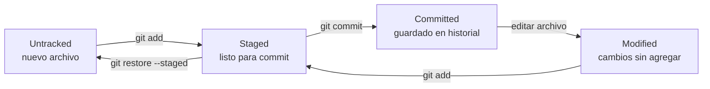

# Plantilla de LECCION.md — Git y GitHub

Usa esta estructura para cada lección. Las secciones marcadas (opcional) se incluyen solo si aportan al tema.

```markdown
# Módulo NN: [Título del módulo]

> **Nivel:** Git y GitHub
> **Requisitos previos:** módulos X, Y
> **Duración estimada:** N horas

## 🌍 ¿Por qué este módulo?

[OBLIGATORIO. 2-3 líneas antes de cualquier teoría: qué problema real resuelve este módulo, qué catástrofe evita en el trabajo diario, y cómo conecta con lo aprendido antes. El objetivo es que el alumno entienda el "para qué" antes de ver el primer comando. Ejemplo: "Alguna vez sobreescribiste un archivo y no pudiste recuperarlo. O trabajaste en equipo y alguien pisó el trabajo de otro. Git existe para que eso no pase."]

## 🎯 Objetivos de aprendizaje

Al terminar este módulo vas a poder:
- [objetivo verificable 1 — acción concreta con un comando o flujo]
- [objetivo verificable 2]
- [3 a 5 objetivos en total]

## 🧠 [Concepto 1]

[Explicación breve del concepto en 2-4 líneas.]

**🤔 ¿Por qué?** [OBLIGATORIO: responder por qué existe este comando o concepto, qué problema resuelve, y cómo funcionaría el flujo sin él. Incluir la analogía cotidiana correspondiente cuando sea la primera vez que aparece el concepto ("El staging area es como una mesa de preparación antes de empacar una caja..."). En módulos avanzados: incluir el "qué pasa por debajo" cuando sea relevante.]

### Ejemplo guiado

> 📂 La secuencia completa de este ejemplo está en `comandos/NN-nombre.md`.

[Construir la secuencia paso a paso. Cada paso: el comando + el output real de la terminal + qué significa cada línea del output.]

```bash
$ comando-de-ejemplo
output real que aparece en la terminal
línea dos del output
```

[Explicación de qué significa el output: qué está diciendo Git, por qué dice eso, qué hacer a continuación.]

```bash
$ siguiente-comando
output del siguiente comando
```

[Qué cambió, qué significa este nuevo estado.]

### Pruébalo tú

[Consigna corta y concreta: ejecutá esta secuencia en tu propia terminal y verificá que obtenés un output similar. Por ejemplo: "Creá una carpeta nueva, inicializá un repo y verificá que `git status` muestra 'nothing to commit'."]

## 🧠 [Concepto 2]

[Repetir el patrón: concepto → ¿Por qué? → ejemplo guiado con output real → pruébalo tú]

[Incluir diagrama Mermaid cuando el concepto sea difícil de visualizar con texto:]

```mermaid
gitgraph
   commit id: "feat: página inicial"
   commit id: "fix: corregir título"
   branch feature/contacto
   checkout feature/contacto
   commit id: "feat: agregar formulario"
   commit id: "feat: validar campos"
   checkout main
   merge feature/contacto id: "Merge feature/contacto"
```

[O para el ciclo de vida de un archivo:]



## ⚠️ Errores comunes

| Error / Situación | Por qué pasa | Cómo resolverlo |
|-------------------|-------------|-----------------|
| `fatal: not a git repository` | Se ejecutó un comando de Git fuera de una carpeta con repo inicializado | Navegar a la carpeta correcta con `cd` o ejecutar `git init` |
| [error específico del módulo 1] | ... | ... |
| [error específico del módulo 2] | ... | ... |
| [2 a 4 errores en total, relevantes al módulo] | ... | ... |

## 📌 Resumen

- [idea clave 1, una línea]
- [idea clave 2]
- [3 a 6 ideas en total]

## 💼 Preguntas de entrevista técnica

[5 preguntas del tipo que aparecen en entrevistas para desarrolladores junior/mid sobre Git. Formularlas como las haría un entrevistador real.]

**1. [Pregunta 1]**

<details><summary>Ver respuesta orientativa</summary>

[Respuesta de 2-4 líneas. No tiene que ser exhaustiva — debe demostrar comprensión del concepto, no memorización.]

</details>

**2. [Pregunta 2]**

<details><summary>Ver respuesta orientativa</summary>

[Respuesta]

</details>

**3. [Pregunta 3]**

<details><summary>Ver respuesta orientativa</summary>

[Respuesta]

</details>

**4. [Pregunta 4]**

<details><summary>Ver respuesta orientativa</summary>

[Respuesta]

</details>

**5. [Pregunta 5]**

<details><summary>Ver respuesta orientativa</summary>

[Respuesta]

</details>

## ➡️ Siguiente paso

Ahora ve a `practica/EJERCICIOS.md`. Cuando los termines, el proyecto del módulo está en `proyecto/PROYECTO.md`.
```

---

## Plantilla de EJERCICIOS.md

```markdown
# Ejercicios — Módulo NN: [tema]

Resuélvelos en orden. Para cada ejercicio, abrí una terminal, creá el entorno descrito y ejecutá los comandos. Cada ejercicio trae su pista y su solución ocultas en bloques desplegables: no las abras hasta intentarlo al menos 15 minutos.

## Ejercicio 1: [nombre] ⭐
**Contexto:** [situación que le da sentido al ejercicio]
**Tarea:** [qué tiene que lograr, expresado como resultado observable]
**Comandos involucrados:** `git X`, `git Y`

<details><summary>💡 Pista</summary>

[Orientación que no resuelve el ejercicio pero encamina al alumno]

</details>

<details><summary>✅ Solución (ábrela solo después de intentarlo)</summary>

```bash
# Secuencia de comandos esperada
$ git init
Initialized empty Git repository in .../

$ git add README.md
$ git commit -m "feat: agregar README inicial"
[main (root-commit) a1b2c3d] feat: agregar README inicial
 1 file changed, 3 insertions(+)
 create mode 100644 README.md
```

[2-3 líneas explicando por qué esta es la secuencia correcta y qué aprendemos de ella.]

</details>

## Ejercicio 2: [nombre] ⭐⭐
[... dificultad creciente: ⭐ a ⭐⭐⭐ ...]
```

---

## Plantilla de PROYECTO.md

```markdown
# Proyecto: [nombre]

## Contexto
[2-3 líneas de historia que le dan sentido al proyecto. Debe parecer una situación real de trabajo, no un ejercicio académico.]

## Objetivo
[Qué debe lograr el alumno, expresado en términos de Git/GitHub, no de código.]

## Requisitos
1. [acción concreta verificable con Git/GitHub]
2. [...]
3. [3 a 6 requisitos en total]

## Criterios de aceptación
- [ ] El repositorio tiene al menos N commits con mensajes descriptivos
- [ ] El `.gitignore` excluye [archivos específicos]
- [ ] [otro criterio que el alumno puede auto-verificar]

## Restricciones
- Solo podés usar comandos vistos hasta el módulo NN.
- [otras restricciones si aplican]

## 🚀 Extras (opcionales)
- [desafío adicional para quien termine rápido]
- [otro extra]

## Cómo empezar
[Instrucciones precisas para arrancar: crear la carpeta, inicializar el repo, etc.]
```
