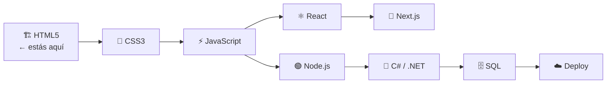

# Módulo NN: [Título del Módulo]

> **Nivel:** HTML5
> **Requisitos previos:** Módulos XX, YY (o "ninguno" si es el primero)
> **Duración estimada:** N horas
> **Archivos de este módulo:** `guia-html5/NN-titulo/`

---

## 🌍 ¿Por qué este módulo?

<!-- OBLIGATORIO: 2-3 líneas de contexto real. Qué problema resuelve, qué se puede construir con esto, por qué el alumno lo necesita. -->

[Ejemplo: "Sin saber estructurar texto en HTML, no podés comunicar información en la web. Este módulo te da las herramientas para dar jerarquía y significado al contenido: no es solo poner palabras en una pantalla, es decirle al browser —y a Google— qué es un título, qué es importante, qué es una lista."]

<!-- SOLO en Módulo 01: incluir diagrama Mermaid del stack del bootcamp marcando "estás aquí" -->
<!--

-->

---

## 🎯 Objetivos de aprendizaje

Al terminar este módulo vas a poder:

- [ ] [Objetivo verificable 1 — usar verbo accionable: "crear", "distinguir", "escribir", "aplicar"]
- [ ] [Objetivo verificable 2]
- [ ] [Objetivo verificable 3]
- [ ] [Objetivo verificable 4]

---

## 🧱 [Etiqueta o Concepto 1]

[Explicación clara de qué hace esta etiqueta/concepto. Incluir sintaxis básica en código.]

```html
<!-- Sintaxis básica -->
<etiqueta atributo="valor">Contenido</etiqueta>
```

**Atributos principales:**

| Atributo | Tipo | Descripción |
|----------|------|-------------|
| `atributo` | string | Para qué sirve |
| `otro` | boolean | Para qué sirve |

**🤔 ¿Por qué esta etiqueta?**

<!-- OBLIGATORIO: explicar el problema semántico que resuelve, la diferencia con alternativas, cómo la interpreta el browser y los lectores de pantalla. No solo "qué hace" sino "por qué existe". -->

[Ejemplo: "`<strong>` no significa 'poner en negrita' — eso es trabajo de CSS. `<strong>` significa que el contenido tiene *importancia semántica*. Un lector de pantalla puede cambiar el tono de voz al leerlo. Google le da más peso a las palabras dentro de `<strong>`. Si usás `<b>` solo obtenés el efecto visual, sin el significado."]

---

### Ejemplo guiado

> 📂 Archivo: `ejemplos/NN-nombre.html`
> Abrirlo con **Live Server** en VS Code (clic derecho en el archivo → "Open with Live Server").

```html
<!DOCTYPE html>
<html lang="es">
<head>
  <meta charset="UTF-8">
  <meta name="viewport" content="width=device-width, initial-scale=1.0">
  <title>[Título descriptivo del ejemplo]</title>
</head>
<body>

  <!-- SECCIÓN: [Nombre de la sección] -->
  <!-- Propósito: [qué muestra este bloque] -->
  <etiqueta>
    Contenido del ejemplo
  </etiqueta>

</body>
</html>
```

**Vista en browser:** [Descripción de lo que el alumno va a ver al abrir el archivo en el browser. Ser específico: "Se verá el texto 'Contenido del ejemplo' con tipografía en negrita, ocupando su propio bloque." o "El cursor cambiará a mano al pasar sobre el enlace."]

### Pruébalo tú

Modificá el archivo `ejemplos/NN-nombre.html` y:
1. [Consigna concreta: "Cambiá `<strong>` por `<b>` y observá si hay diferencia visual. Luego activá un lector de pantalla y notá la diferencia en el audio."]
2. [Segunda consigna opcional]

---

## 🧱 [Etiqueta o Concepto 2]

[Repetir la misma estructura para cada concepto del módulo]

---

<!-- Agregar tantas secciones como subtemas tenga el módulo según el temario -->

---

## 🔍 ¿Cómo lo ve el browser vs. un lector de pantalla?

<!-- INCLUIR cuando el módulo trata etiquetas de accesibilidad o semántica (módulos 02, 04, 06) -->

| Etiqueta | Vista en browser | Lector de pantalla (NVDA/VoiceOver) |
|----------|-----------------|--------------------------------------|
| `<etiqueta>` | [comportamiento visual] | [qué anuncia el screen reader] |
| `<otra>` | [comportamiento visual] | [qué anuncia el screen reader] |

---

## 🌳 Estructura del DOM

<!-- INCLUIR cuando el módulo introduce estructura de documento o layout semántico -->

```mermaid
graph TD
    HTML --> HEAD
    HTML --> BODY
    HEAD --> TITLE["title: [Título]"]
    HEAD --> META1["meta charset"]
    HEAD --> META2["meta viewport"]
    BODY --> [ETIQUETA1]
    BODY --> [ETIQUETA2]
    [ETIQUETA1] --> [HIJO1]
    [ETIQUETA1] --> [HIJO2]
```

---

## ⚠️ Errores comunes

| Error | Por qué pasa | Cómo evitarlo |
|-------|-------------|---------------|
| [Error 1: ej. "Olvidar el `alt` en ``"] | [Causa: "No se ve en el browser si hay imagen"] | [Solución: "Siempre agregar `alt` — vacío si es decorativa, descriptivo si es informativa"] |
| [Error 2] | [Causa] | [Solución] |
| [Error 3] | [Causa] | [Solución] |
| [Error 4] | [Causa] | [Solución] |

---

## 📌 Resumen

- [Idea clave 1 — una línea]
- [Idea clave 2 — una línea]
- [Idea clave 3 — una línea]
- [Idea clave 4 — una línea]
- [Idea clave 5 — una línea]

---

## ✅ Checklist antes de seguir

Antes de pasar a los ejercicios, verificá:

- [ ] ¿Todos mis archivos `.html` tienen `<!DOCTYPE html>`?
- [ ] ¿El `<html>` tiene `lang="es"` (o el idioma del contenido)?
- [ ] ¿El `<head>` tiene `<meta charset="UTF-8">`?
- [ ] ¿Usé la etiqueta semántica correcta para cada tipo de contenido?
- [ ] [Checklist específico del módulo — ej. "¿Todos los `` tienen `alt`?"]
- [ ] [Otro item específico]

---

## 💼 Preguntas de entrevista técnica

Estas preguntas aparecen realmente en entrevistas para puestos de desarrollo front-end.

1. [Pregunta real sobre los temas del módulo]
2. [Pregunta real]
3. [Pregunta real]
4. [Pregunta real]
5. [Pregunta real]

<details>
<summary>Ver respuestas orientativas</summary>

**1. [Pregunta 1]**
[Respuesta orientativa — no la respuesta "correcta" única, sino los puntos clave que demuestran comprensión]

**2. [Pregunta 2]**
[Respuesta orientativa]

**3. [Pregunta 3]**
[Respuesta orientativa]

**4. [Pregunta 4]**
[Respuesta orientativa]

**5. [Pregunta 5]**
[Respuesta orientativa]

</details>

---

## 🔗 Recursos adicionales

- [MDN Web Docs — [Etiqueta principal]](https://developer.mozilla.org/es/docs/Web/HTML/Element/etiqueta)
- [W3C Validator](https://validator.w3.org/) — validar el HTML generado en este módulo
- [Recurso específico del módulo si aplica]

---

## ➡️ Siguiente paso

Ahora que conocés los conceptos, es hora de practicar.

Ve a `practica/EJERCICIOS.md` y completá los ejercicios del módulo.
Cuando los termines, pasá al proyecto en `proyecto/PROYECTO.md`.

> **Siguiente módulo:** [NN+1 — Nombre del próximo módulo] (`guia-html5/NN+1-titulo/`)
